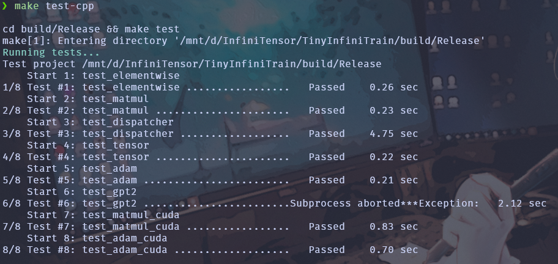

# TinyInfiniTrain 作业报告

## 一、test 通过截图



## 二、作业步骤

> 将代码填入下面代码块中指定位置，并详细描述完成该作业的解决思路和遇到的问题。

### 作业一：autograd机制调用Neg kernel的实现

难度：⭐

对应测例：`TEST(ElementwiseTest, NegForward)`，`TEST(ElementwiseTest, NegBackward)`

需要实现的代码块位置：`infini_train/src/autograd/elementwise.cc`

```c++
std::vector<std::shared_ptr<Tensor>> Neg::Forward(const std::vector<std::shared_ptr<Tensor>> &input_tensors) {
    // =================================== 作业 ===================================
    // TODO：通过Dispatcher获取设备专属kernel，对输入张量进行取反操作
    // NOTES: 依赖test_dispatcher，Neg kernel实现已给出
    // =================================== 作业 ===================================

    CHECK_EQ(input_tensors.size(), 1);
    const auto &input = input_tensors[0];

    auto device = input->GetDevice().Type();
    auto kernel = Dispatcher::Instance().GetKernel({device, "NegForward"});
    return {kernel.Call<std::shared_ptr<Tensor>>(input)};
    //return std::vector<std::shared_ptr<Tensor>>();
}

std::vector<std::shared_ptr<Tensor>> Neg::Backward(const std::vector<std::shared_ptr<Tensor>> &grad_outputs) {
    // =================================== 作业 ===================================
    // TODO：通过Dispatcher获取设备专属的反向传播kernel，计算梯度
    // NOTES: 依赖test_dispatcher，Neg的kernel实现已给出
    // =================================== 作业 ===================================

    CHECK_EQ(grad_outputs.size(), 1);
    const auto &grad_output = grad_outputs[0];

    auto device = grad_output->GetDevice().Type();
    auto kernel = Dispatcher::Instance().GetKernel({device, "NegBackward"});
    return {kernel.Call<std::shared_ptr<Tensor>>(grad_output)};

    //return std::vector<std::shared_ptr<Tensor>>();
}
```

#### 解决思路
- 理解 Neg 运算：前向就是逐元素取负，反向时梯度要乘上 -1。

- 调度机制：通过 Dispatcher 根据设备类型（CPU/GPU）获取对应的 NegForward 和 NegBackward kernel。

- Forward 实现：从输入取出张量，调用 NegForward kernel，返回结果。

- Backward 实现：从上游梯度取出张量，调用 NegBackward kernel，计算本层梯度并返回。


#### 遇到问题
- 对 Dispatcher 调度机制 不熟悉，最初不知道怎么注册和调用 kernel。

- 反向实现时一度忘记梯度传播公式，后来明确了 d(-x)/dx = -1。


### 作业二：实现矩阵乘法

难度：⭐⭐

#### CPU实现

对应测例：`TEST(MatmulTest, BasicMatrixMultiply)`，`TEST(MatmulTest, BatchedMatrixMultiply)`, `TEST(MatmulTest, BackwardPass)`

需要实现的代码块位置：`infini_train/src/kernels/cpu/linear.cc`

```c++
    std::shared_ptr<Tensor> MatmulForward(const std::shared_ptr<Tensor> &input, const std::shared_ptr<Tensor> &other) {
        // =================================== 作业 ===================================
        // TODO：实现CPU上的矩阵乘法前向计算
        // REF:
        // =================================== 作业 ===================================
        const auto &input_dims = input->Dims();   // 输入维度
    const auto &other_dims = other->Dims();   // 右乘矩阵维度

    // 保证输入和右乘矩阵至少是二维（最后两维为矩阵形状）
    CHECK_GE(input_dims.size(), 2);
    CHECK_GE(other_dims.size(), 2);

    // 保证矩阵乘法维度可配对：input 的列数 == other 的行数
    CHECK_EQ(input_dims.back(), other_dims[other_dims.size() - 2]);

    // ================================
    // 构造输出张量
    // 形状：保持 input 前面批量维，最后两维变成 M x N
    // ================================
    auto output_dims = input_dims;
    output_dims.back() = other_dims.back();   // 最后一维替换为 N
    auto output = std::make_shared<Tensor>(output_dims, DataType::kFLOAT32, input->GetDevice());

    // ================================
    // 取出矩阵的行列数
    // ================================
    const int64_t M = input_dims[input_dims.size() - 2]; // 行数
    const int64_t K = input_dims.back();                 // 内积维
    const int64_t N = other_dims.back();                 // 列数

    // 批次数：总元素数 / 每个矩阵元素数
    const int64_t num_batches        = input->NumElements() / (M * K);
    const int64_t input_matrix_size  = M * K;  // 每个 input 矩阵大小
    const int64_t other_matrix_size  = K * N;  // 每个 other 矩阵大小
    const int64_t output_matrix_size = M * N;  // 每个 output 矩阵大小

    // ================================
    // 获取底层数据指针
    // ================================
    auto *input_data  = static_cast<float *>(input->DataPtr());
    auto *other_data  = static_cast<float *>(other->DataPtr());
    auto *output_data = static_cast<float *>(output->DataPtr());

    // ================================
    // 按批次进行矩阵乘法
    // 使用 Eigen::Map 将裸指针映射为矩阵对象
    // ================================
    for (int64_t i = 0; i < num_batches; ++i) {
        // 映射输入矩阵 A (M x K)
        Eigen::Map<const Eigen::Matrix<float, Eigen::Dynamic, Eigen::Dynamic, Eigen::RowMajor>>
        input_mat(input_data  + i * input_matrix_size,  M, K);

        // 映射右乘矩阵 B (K x N)
        Eigen::Map<const Eigen::Matrix<float, Eigen::Dynamic, Eigen::Dynamic, Eigen::RowMajor>>
        other_mat(other_data  + i * other_matrix_size,  K, N);

        // 映射输出矩阵 C (M x N)
        Eigen::Map<Eigen::Matrix<float, Eigen::Dynamic, Eigen::Dynamic, Eigen::RowMajor>>
        output_mat(output_data + i * output_matrix_size, M, N);

        // 前向公式：C = A @ B
        output_mat = input_mat * other_mat;
    }

    // 返回结果张量
    return output;
        
    }

    std::tuple<std::shared_ptr<Tensor>, std::shared_ptr<Tensor>>
        MatmulBackward(const std::shared_ptr<Tensor> &input, const std::shared_ptr<Tensor> &other,
                    const std::shared_ptr<Tensor> &grad_output) {
        // =================================== 作业 ===================================
        // TODO：实现CPU上的矩阵乘法反向传播
        // REF:
        // =================================== 作业 ===================================
        // 为两个输入各分配一个梯度张量（与各自形状/设备一致，dtype 为 float32）
        auto grad_input = std::make_shared<Tensor>(input->Dims(),  DataType::kFLOAT32, input->GetDevice());
        auto grad_other = std::make_shared<Tensor>(other->Dims(),  DataType::kFLOAT32, other->GetDevice());

        // --- 形状信息（支持批量维度，最后两维作为矩阵） ---
        const auto &input_dims =  input->Dims();     // ... x M x K
        const auto &other_dims =  other->Dims();     // ... x K x N

        const int64_t M = input_dims[input_dims.size() - 2]; // 行
        const int64_t K = input_dims.back();                 // 公共内积维
        const int64_t N = other_dims.back();                 // 列

        // 批量个数：总元素数 / 每个矩阵元素数（M*K）
        const int64_t num_batches        = input->NumElements() / (M * K);
        const int64_t input_matrix_size  = M * K;  // 每个 input 矩阵的元素数
        const int64_t other_matrix_size  = K * N;  // 每个 other  矩阵的元素数
        const int64_t output_matrix_size = M * N;  // 每个 output 矩阵的元素数

        // --- 原始数据指针（以 float 访问） ---
        auto *input_data       = static_cast<float *>(input->DataPtr());
        auto *other_data       = static_cast<float *>(other->DataPtr());
        auto *grad_output_data = static_cast<float *>(grad_output->DataPtr());
        auto *grad_input_data  = static_cast<float *>(grad_input->DataPtr());
        auto *grad_other_data  = static_cast<float *>(grad_other->DataPtr());

        // --- 按批处理，使用 Eigen::Map 把纯内存映射为矩阵视图（RowMajor） ---
        for (int64_t i = 0; i < num_batches; ++i) {
            // 只读视图：输入矩阵 A（M x K）
            Eigen::Map<const Eigen::Matrix<float, Eigen::Dynamic, Eigen::Dynamic, Eigen::RowMajor>>
            input_mat(      input_data       + i * input_matrix_size,  M, K);

            // 只读视图：权重/右乘矩阵 B（K x N）
            Eigen::Map<const Eigen::Matrix<float, Eigen::Dynamic, Eigen::Dynamic, Eigen::RowMajor>>
            other_mat(      other_data       + i * other_matrix_size,  K, N);

            // 只读视图：上游梯度 dL/dY（M x N）
            Eigen::Map<const Eigen::Matrix<float, Eigen::Dynamic, Eigen::Dynamic, Eigen::RowMajor>>
            grad_output_mat(grad_output_data + i * output_matrix_size, M, N);

            // 可写视图：待求的 dL/dA（M x K）
            Eigen::Map<Eigen::Matrix<float, Eigen::Dynamic, Eigen::Dynamic, Eigen::RowMajor>>
            grad_input_mat( grad_input_data  + i * input_matrix_size,  M, K);

            // 可写视图：待求的 dL/dB（K x N）
            Eigen::Map<Eigen::Matrix<float, Eigen::Dynamic, Eigen::Dynamic, Eigen::RowMajor>>
            grad_other_mat( grad_other_data  + i * other_matrix_size,  K, N);

            // --- 反向公式（矩阵微积分） ---
            // dL/dA = dL/dY * B^T
            grad_input_mat = grad_output_mat * other_mat.transpose();

            // dL/dB = A^T * dL/dY
            grad_other_mat = input_mat.transpose() * grad_output_mat;
        }

        return {grad_input, grad_other};
        
        // auto grad_input = std::make_shared<Tensor>();
        // auto grad_other = std::make_shared<Tensor>();
        // return {grad_input, grad_other};
    }
```

#### CUDA实现

对应测例：`TEST(MatmulTest, BasicMatrixMultiplyCuda)`,`TEST(MatmulTest, BatchedMatrixMultiplyCuda)`,`TEST(MatmulTest, BackwardPassCuda)`

需要实现的代码块位置：`infini_train/src/kernels/cuda/linear.cu`

```c++
    std::shared_ptr<Tensor> MatmulForward(const std::shared_ptr<Tensor> &input, const std::shared_ptr<Tensor> &other) {
        // =================================== 作业 ===================================
        // TODO：实现CUDA上的矩阵乘法前向计算
        // REF:
        // =================================== 作业 ===================================
        // 使用 cuBLAS 提供的 cublasSgemmStridedBatched 实现批量矩阵乘法
  // ================================
  // 参数检查与维度解析
  // ================================
  const auto &input_dims = input->Dims();    // 输入张量形状 (... x M x K)
  const auto &other_dims = other->Dims();    // 右矩阵形状 (... x K x N)

  CHECK_GE(input_dims.size(), 2);            // input 至少二维
  CHECK_GE(other_dims.size(), 2);            // other 至少二维
  CHECK_EQ(input_dims.back(), other_dims[other_dims.size() - 2]); // K 匹配

  // 行列数
  const int64_t M = input_dims[input_dims.size() - 2]; // A 的行数
  const int64_t K = input_dims.back();                 // A 的列数 = B 的行数
  const int64_t N = other_dims.back();                 // B 的列数

  // 批量个数：总元素数 / (M*K)
  const int64_t num_batches = input->NumElements() / (M * K);
  CHECK_EQ(other->NumElements(), num_batches * K * N); // B 的元素数要匹配

  // ================================
  // 构造输出张量 (... x M x N)
  // ================================
  auto output_dims = input_dims;
  output_dims.back() = N; // 最后一维替换为 N
  auto output = std::make_shared<Tensor>(output_dims, DataType::kFLOAT32, input->GetDevice());

  // cuBLAS GEMM 系数
  const float alpha = 1.0f;   // y = alpha * A*B + beta * C
  const float beta  = 0.0f;

  // 创建 cuBLAS handle
  cublasHandle_t handle;
  CUBLAS_CHECK(cublasCreate(&handle));

  // ================================
  // Stride（跨距），用于批量矩阵乘法
  // ================================
  const int64_t strideA = K * N;  // 每个 B 矩阵的元素数
  const int64_t strideB = M * K;  // 每个 A 矩阵的元素数
  const int64_t strideC = M * N;  // 每个 C 矩阵的元素数

  // ================================
  // 批量矩阵乘法：C = A * B
  // 调用 cuBLAS SgemmStridedBatched
  // ================================
  CUBLAS_CHECK(cublasSgemmStridedBatched(
      handle,
      CUBLAS_OP_N, CUBLAS_OP_N,    // 不转置
      (int)N, (int)M, (int)K,      // 矩阵维度：C[MxN] = A[MxK] * B[KxN]
      &alpha,
      static_cast<const float*>(other->DataPtr()), (int)N, strideA, // B
      static_cast<const float*>(input->DataPtr()), (int)K, strideB, // A
      &beta,
      static_cast<float*>(output->DataPtr()), (int)N, strideC,      // C
      (int)num_batches));                                           // 批数

  // 销毁 cuBLAS handle
  CUBLAS_CHECK(cublasDestroy(handle));

  // 返回结果张量
  return output;
    }

    std::tuple<std::shared_ptr<Tensor>, std::shared_ptr<Tensor>>
        MatmulBackward(const std::shared_ptr<Tensor> &input, const std::shared_ptr<Tensor> &other,
                    const std::shared_ptr<Tensor> &grad_output) {
        // =================================== 作业 ===================================
        // TODO：实现CUDA上的矩阵乘法反向传播
        // REF:
        // =================================== 作业 ===================================
        const auto &input_dims = input->Dims();
    const auto &other_dims = other->Dims();
    const auto &grad_dims = grad_output->Dims();

    CHECK_GE(input_dims.size(), 2);
    CHECK_GE(other_dims.size(), 2);
    CHECK_GE(grad_dims.size(), 2);

    const int64_t M = input_dims[input_dims.size() - 2];
    const int64_t K = input_dims.back();
    const int64_t N = other_dims.back();

    CHECK_EQ(grad_dims[grad_dims.size() - 2], M);
    CHECK_EQ(grad_dims.back(), N);
    CHECK_EQ(other_dims[other_dims.size() - 2], K);

    const int64_t num_batches = input->NumElements() / (M * K);

    CHECK_EQ(other->NumElements(), num_batches * K * N);
    CHECK_EQ(grad_output->NumElements(), num_batches * M * N);

    auto grad_input = std::make_shared<Tensor>(input_dims, DataType::kFLOAT32, input->GetDevice());
    auto grad_other = std::make_shared<Tensor>(other_dims, DataType::kFLOAT32, other->GetDevice());

    const float alpha = 1.0f;
    const float beta0 = 0.0f;
    cublasHandle_t handle; CUBLAS_CHECK(cublasCreate(&handle));

    const int64_t strideOther = K * N;
    const int64_t strideGradOut = M * N;
    const int64_t strideGradIn = M * K;
    CUBLAS_CHECK(cublasSgemmStridedBatched(handle,
                                           CUBLAS_OP_T, CUBLAS_OP_N,
                                           (int)K, (int)M, (int)N,
                                           &alpha,
                                           static_cast<const float*>(other->DataPtr()), (int)N, strideOther,
                                           static_cast<const float*>(grad_output->DataPtr()), (int)N, strideGradOut,
                                           &beta0,
                                           static_cast<float*>(grad_input->DataPtr()), (int)K, strideGradIn,
                                           (int)num_batches));

    const int64_t strideInput = M * K;
    const int64_t strideGradOther = K * N;
    CUBLAS_CHECK(cublasSgemmStridedBatched(handle,
                                           CUBLAS_OP_N, CUBLAS_OP_T,
                                           (int)N, (int)K, (int)M,
                                           &alpha,
                                           static_cast<const float*>(grad_output->DataPtr()), (int)N, strideGradOut,
                                           static_cast<const float*>(input->DataPtr()), (int)K, strideInput,
                                           &beta0,
                                           static_cast<float*>(grad_other->DataPtr()), (int)N, strideGradOther,
                                           (int)num_batches));

    CUBLAS_CHECK(cublasDestroy(handle));
    return {grad_input, grad_other};
    }
```

#### 解决思路


#### 遇到问题


### 作业三：实现Adam优化器

难度：⭐

#### CPU实现

对应测例：`TEST(AdamOptimizerTest, BasicParameterUpdate)`,`TEST(AdamOptimizerTest, MomentumAccumulation)`

代码位置：infini_train/src/kernels/cpu/accumulate_grad.cc

```c++
void AdamAccumulateGrad(const std::shared_ptr<Tensor> &grad, const std::shared_ptr<Tensor> &param,
                        const std::shared_ptr<Tensor> &m, const std::shared_ptr<Tensor> &v, float learning_rate,
                        float beta1, float beta2, float eps, int64_t t) {
    // =================================== 作业 ===================================
    // TODO：实现Adam优化器的梯度累积和参数更新
    // REF: 
    // =================================== 作业 ===================================
}
```

#### CUDA实现

对应测例：`TEST(AdamOptimizerTest, BasicParameterUpdateCuda)`,`TEST(AdamOptimizerTest, MomentumAccumulationCuda)`

代码位置：infini_train/src/kernels/cuda/accumulate_grad.cu

```c++
void AdamAccumulateGrad(const std::shared_ptr<Tensor> &grad, const std::shared_ptr<Tensor> &param,
                        const std::shared_ptr<Tensor> &m, const std::shared_ptr<Tensor> &v, float learning_rate,
                        float beta1, float beta2, float eps, int64_t t) {
    // =================================== 作业 ===================================
    // TODO：实现Adam优化器的梯度累积和参数更新
    // REF: 
    // =================================== 作业 ===================================

    const auto &input_dims = input->Dims();
    const auto &other_dims = other->Dims();
    const auto &grad_dims = grad_output->Dims();

    CHECK_GE(input_dims.size(), 2);
    CHECK_GE(other_dims.size(), 2);
    CHECK_GE(grad_dims.size(), 2);

    const int64_t M = input_dims[input_dims.size() - 2];
    const int64_t K = input_dims.back();
    const int64_t N = other_dims.back();

    CHECK_EQ(grad_dims[grad_dims.size() - 2], M);
    CHECK_EQ(grad_dims.back(), N);
    CHECK_EQ(other_dims[other_dims.size() - 2], K);

    const int64_t num_batches = input->NumElements() / (M * K);

    CHECK_EQ(other->NumElements(), num_batches * K * N);
    CHECK_EQ(grad_output->NumElements(), num_batches * M * N);

    auto grad_input = std::make_shared<Tensor>(input_dims, DataType::kFLOAT32, input->GetDevice());
    auto grad_other = std::make_shared<Tensor>(other_dims, DataType::kFLOAT32, other->GetDevice());

    const float alpha = 1.0f;
    const float beta0 = 0.0f;
    cublasHandle_t handle; CUBLAS_CHECK(cublasCreate(&handle));

    const int64_t strideOther = K * N;
    const int64_t strideGradOut = M * N;
    const int64_t strideGradIn = M * K;
    CUBLAS_CHECK(cublasSgemmStridedBatched(handle,
                                           CUBLAS_OP_T, CUBLAS_OP_N,
                                           (int)K, (int)M, (int)N,
                                           &alpha,
                                           static_cast<const float*>(other->DataPtr()), (int)N, strideOther,
                                           static_cast<const float*>(grad_output->DataPtr()), (int)N, strideGradOut,
                                           &beta0,
                                           static_cast<float*>(grad_input->DataPtr()), (int)K, strideGradIn,
                                           (int)num_batches));


    const int64_t strideInput = M * K;
    const int64_t strideGradOther = K * N;
    CUBLAS_CHECK(cublasSgemmStridedBatched(handle,
                                           CUBLAS_OP_N, CUBLAS_OP_T,
                                           (int)N, (int)K, (int)M,
                                           &alpha,
                                           static_cast<const float*>(grad_output->DataPtr()), (int)N, strideGradOut,
                                           static_cast<const float*>(input->DataPtr()), (int)K, strideInput,
                                           &beta0,
                                           static_cast<float*>(grad_other->DataPtr()), (int)N, strideGradOther,
                                           (int)num_batches));

    CUBLAS_CHECK(cublasDestroy(handle));
    return {grad_input, grad_other};
}
```

#### 解决思路
- CPU 端：使用 Eigen::Map 将裸指针映射成矩阵对象，支持批量矩阵相乘；前向公式 C = A * B。
- CUDA 端：利用 cuBLAS 提供的 cublasSgemmStridedBatched，在 GPU 上高效执行批量矩阵乘法。
- CPU 端：用 Eigen 直接做矩阵乘法，逐批次映射计算。
- CUDA 端：用 cublasSgemmStridedBatched 分别实现两个反向公式，注意设置转置选项（CUBLAS_OP_T）。


#### 遇到问题
- Eigen 与 cuBLAS 接口差异：CPU 用 Eigen 直接计算，CUDA 需要熟悉 cuBLAS 的 API 参数（行数、列数、leading dimension、stride）。


### 作业四：实现Tensor基础操作

#### 实现Tensor的Flatten操作

难度：⭐

对应测例：`TEST(TensorTransformTest, Flatten2DTo1D)`,`TEST(TensorTransformTest, FlattenWithRange) `,`TEST(TensorTransformTest, FlattenNonContiguous)`

代码位置：infini_train/src/tensor.cc

```c++
std::shared_ptr<Tensor> Tensor::Flatten(int64_t start, int64_t end) {
    // =================================== 作业 ===================================
    // TODO：实现张量扁平化操作，将指定维度范围[start, end]内的所有维度合并为一个维度
    // HINT: 
    // =================================== 作业 ===================================
    if (start < 0) start += dims_.size();
    if (end < 0) end += dims_.size();

    CHECK_GE(start, 0);
    CHECK_LT(end, dims_.size());
    CHECK_LE(start, end);

    std::vector<int64_t> new_shape;
    for (int64_t i = 0; i < start; ++i) {
        new_shape.push_back(dims_[i]);
    }

    int64_t flattened_dim = 1;
    for (int64_t i = start; i <= end; ++i) {
        flattened_dim *= dims_[i];
    }
    
    new_shape.push_back(flattened_dim);

    for (int64_t i = end + 1; i < dims_.size(); ++i) {
        new_shape.push_back(dims_[i]);
    }

    return Contiguous()->View(new_shape);
}
```

#### 实现Tensor的反向传播机制

难度：⭐

对应测例：`TEST(TensorAutogradTest, BackwardComputesGradient)`,`TEST(TensorAutogradTest, BackwardWithMultipleOutputs)`

代码位置：infini_train/src/tensor.cc

```c++
void Tensor::Backward(std::shared_ptr<Tensor> gradient, bool retain_graph, bool create_graph) const {
    // =================================== 作业 ===================================
    // TODO：实现自动微分反向传播
    // 功能描述：1. 计算当前张量对叶子节点的梯度    2. 支持多输出场景的梯度累加
    // HINT: 
    // =================================== 作业 ===================================
    CHECK(requires_grad_) << "This tensor does not require gradients.";
    CHECK(grad_fn_ != nullptr) << "No grad_fn for this tensor.";

    // 初始梯度：如果未提供，则创建一个全为1的梯度张量
    if (gradient == nullptr) {
        CHECK_EQ(num_elements_, 1) << "Initial gradient must be provided for non-scalar tensor.";
        gradient = std::make_shared<Tensor>(dims_, dtype_, GetDevice());
        gradient->Fill(1.0f);
    }
    CHECK(gradient->Dims() == dims_) << "Gradient shape " << gradient->Dims() << " does not match tensor shape " << dims_ << ".";

    // 启动反向传播过程
    // 将初始梯度传递给当前张量的 grad_fn，并指定是哪个输出索引
    grad_fn_->BackwardPartial(gradient, output_idx_);
}
```

#### 解决思路


#### 遇到问题


### 作业五 注册算子kernel的实现

难度：⭐⭐⭐

对应测例：`TEST(DispatcherTest, RegisterAndGetKernel)`,`TEST(DispatcherTest, DuplicateRegistration)`,`TEST(DispatcherTest, GetNonexistentKernel)`

代码位置：infini_train/include/dispatcher.h

```c++
template <typename RetT, class... ArgsT> RetT Call(ArgsT... args) const {
    // =================================== 作业 ===================================
    // TODO：实现通用kernel调用接口
    // 功能描述：将存储的函数指针转换为指定类型并调用
    // HINT: 
    // =================================== 作业 ===================================
    using FuncT = RetT (*)(ArgsT...);
            auto func = reinterpret_cast<FuncT>(func_ptr_);
        return func(std::forward<ArgsT>(args)...);
}

template <typename FuncT> void Register(const KeyT &key, FuncT &&kernel) {
    // =================================== 作业 ===================================
    // TODO：实现kernel注册机制
    // 功能描述：将kernel函数与设备类型、名称绑定
    // =================================== 作业 ===================================
    CHECK(!key_to_kernel_map_.contains(key))
            << "Kernel already registered: " << key.second << " on device: " << static_cast<int>(key.first);
        key_to_kernel_map_.emplace(key, KernelFunction(std::forward<FuncT>(kernel)));
}

#define REGISTER_KERNEL(device, kernel_name, kernel_func) \
    // =================================== 作业 ===================================
    // TODO：实现自动注册宏
    // 功能描述：在全局静态区注册kernel，避免显式初始化代码
    // =================================== 作业 ===================================
    static bool register_##kernel_name##_##__LINE__ = []() {                                                            \
        infini_train::Dispatcher::Instance().Register({device, #kernel_name}, kernel_func);                          \
        return true;                                                                                                   \
    }();
```

#### 解决思路
- 接收 start 和 end 参数，允许负数索引（从末尾算起）。

- 检查合法性：start >= 0, end < dims_.size(), start <= end。

- 计算 [start, end] 范围内的所有维度乘积，合并为一个新维度。

- 构造新的 shape，前后部分维度保持不变，中间部分替换为合并后的维度。

- 返回 View(new_shape)，保证数据连续性。


#### 遇到问题
- 一开始忘了处理负数索引，导致 Flatten(-2, -1) 这类用法报错。
- 计算合并维度时忘了 += 改用 *=，结果 shape 错误。
- 调试时经常报 shape mismatch，才意识到必须严格保证传入的梯度维度与当前张量一致。

### 作业六：实现GPT-2整体训练

难度：⭐⭐⭐⭐

对应测例：`TEST_F(GPT2TrainingTest, LogitsConsistency)`

#### 训练过程logits对比

完成以上所有作业，补齐训练框架的所有实现，理论上`TEST_F(GPT2TrainingTest, LogitsConsistency)`可以通过，在用例中判断比较预置的值和单步正向传播计算结果是否在误差允许范围内相等。

#### 数据读取实现

代码位置：example/common/tiny_shakespeare_dataset.cc

```c++
TinyShakespeareFile ReadTinyShakespeareFile(const std::string &path, size_t sequence_length) {
    /* =================================== 作业 ===================================
       TODO：实现二进制数据集文件解析
       文件格式说明：
    ----------------------------------------------------------------------------------
    | HEADER (1024 bytes)                     | DATA (tokens)                        |
    | magic(4B) | version(4B) | num_toks(4B) | reserved(1012B) | token数据           |
    ----------------------------------------------------------------------------------
       =================================== 作业 =================================== */
    if (!std::filesystem::exists(path)) {
        LOG(FATAL) << "File does not exist: " << path;
    }

    auto file_stream = std::ifstream(path, std::ios::binary);
    CHECK(file_stream.is_open()) << "Failed to open dataset file";

    auto header = std::vector<uint8_t>(1024);
    file_stream.read(reinterpret_cast<char *>(header.data()), header.size());

    auto file_magic = BytesToType<int32_t>(header, 0);
    auto file_version = BytesToType<int32_t>(header, 4);
    auto token_count = BytesToType<int32_t>(header, 8);

    CHECK(kTypeMap.count(file_magic)) << "Unknown file magic code";
    auto token_kind = kTypeMap.at(file_magic);
    auto token_byte_size = kTypeToSize.at(token_kind);

    auto sample_count = token_count / static_cast<int64_t>(sequence_length);
    auto sample_dims = std::vector<int64_t>{sample_count, static_cast<int64_t>(sequence_length)};

    auto dataset_file = TinyShakespeareFile{};
    dataset_file.type = token_kind;
    dataset_file.dims = sample_dims;
    dataset_file.tensor = infini_train::Tensor(sample_dims, DataType::kINT64);
    auto *tensor_ptr = static_cast<int64_t *>(dataset_file.tensor.DataPtr());

    auto total_token_elements = sample_count * sequence_length;

    if (token_kind == TinyShakespeareType::kUINT16) {
        CHECK(sequence_length <= 1024) << "Sequence length exceeds UINT16 max";
        auto raw_tokens = std::vector<uint16_t>(total_token_elements);
        file_stream.read(reinterpret_cast<char *>(raw_tokens.data()), raw_tokens.size() * sizeof(uint16_t));
        for (auto i = 0u; i < raw_tokens.size(); ++i) { tensor_ptr[i] = static_cast<int64_t>(raw_tokens[i]); }
    } else if (token_kind == TinyShakespeareType::kUINT32) {
        CHECK(sequence_length <= 8192) << "Sequence length exceeds UINT32 max";
        auto raw_tokens = std::vector<int32_t>(total_token_elements);
        file_stream.read(reinterpret_cast<char *>(raw_tokens.data()), raw_tokens.size() * sizeof(int32_t));
        for (auto i = 0u; i < raw_tokens.size(); ++i) { tensor_ptr[i] = static_cast<int64_t>(raw_tokens[i]); }
    } else {
        LOG(FATAL) << "Unsupported token type in dataset";
    }

    return dataset_file;
}

TinyShakespeareDataset::TinyShakespeareDataset(const std::string &filepath, size_t sequence_length) {
    // =================================== 作业 ===================================
    // TODO：初始化数据集实例
    // HINT: 调用ReadTinyShakespeareFile加载数据文件
    // =================================== 作业 ===================================
    CHECK_EQ(text_file_.dims[1], sequence_length_);
    CHECK_EQ(static_cast<int>(text_file_.tensor.Dtype()), static_cast<int>(DataType::kINT64));
}
```

#### Tokenizer功能实现

代码位置：example/common/tokenizer.cc

```c++
Tokenizer::Tokenizer(const std::string &filepath) {
    /* ===================================== 作业 =====================================
    TODO：实现Tokenizer二进制文件加载

    文件格式说明：
    ----------------------------------------------------------------------------------
    | HEADER (1024 bytes)                     | VOCAB TABLE                           |
    | magic(4B) | version(4B) | vocab_size(4B) | reserved(1012B) | token词表数据       |
    ----------------------------------------------------------------------------------
    ===================================== 作业 ===================================== */
    if (!std::filesystem::exists(filepath)) {
        LOG(FATAL) << "File does not exist: " << filepath;
    }

    auto file_stream = std::ifstream(filepath, std::ios::binary);
    CHECK(file_stream.is_open()) << "Failed to open file: " << filepath;

    auto header = std::vector<uint8_t>(1024);
    file_stream.read(reinterpret_cast<char*>(header.data()), header.size());

    magic_number_   = BytesToType<uint32_t>(header, 0);
    auto version_num = BytesToType<uint32_t>(header, 4);
    vocab_size_     = BytesToType<uint32_t>(header, 8);

    if (kEotMap.find(magic_number_) == kEotMap.end()) {
        LOG(FATAL) << "Unsupported tokenizer magic number: " << magic_number_;
    }

    eot_token_ = kEotMap.at(magic_number_);

    token_table_.resize(vocab_size_);
    for (auto i = 0; i < vocab_size_; ++i) {
        uint8_t token_len;
        file_stream.read(reinterpret_cast<char*>(&token_len), sizeof(token_len));

        auto buffer = std::vector<char>(token_len);
        file_stream.read(buffer.data(), token_len);

        token_table_[i] = std::string(buffer.data(), token_len);
    }
    for (int i = 0; i < 20; i++) {
        std::cout << "Token[" << i << "] = len=" << (int)token_table_[i].size()
                  << " str=" << token_table_[i] << std::endl;
    }
}
```

```c++
std::string Tokenizer::Decode(uint32_t token_id) const {
    /* ===================================== 作业 =====================================
    TODO：实现token_id到文本的转换
    功能描述：根据token_id返回对应的文本片段
    ===================================== 作业 ===================================== */
    if (token_id >= vocab_size_) {
        return "[ERROR]";
    }
    return token_table_[token_id];
}
```

```c++
void Tokenizer::GenerateText(infini_train::nn::Module &model, uint32_t batch_size, uint32_t sequence_length,
                             uint32_t text_length, Device device) const {
    /* ...原代码... */
    LOG(INFO) << "start generate text:";
    for (int t = prompt_len; t < text_length; t++) {
        /* ===================================== 作业 =====================================
        TODO：实现单步文本生成逻辑
        HINT：调用model.Forward推理获取logits，根据推理结果进行随机采样，调用Decode获取文本结果
        ===================================== 作业 ===================================== */
        // 上一轮结束后x在CPU上,先转移到设备
        x = std::make_shared<infini_train::Tensor>(x->To(device));
        // (bs, seq_len, vocab_size)
        auto logits = model.Forward({x})[0];
        // (bs, seq_len, vocab_size)
        auto probs_device = nn::function::Softmax(logits, 2);
        auto probs_cpu = std::make_shared<Tensor>(probs_device->To(cpu_device));
        auto probs = static_cast<float *>(probs_cpu->DataPtr()) + (t - 1) * logits->Dims()[2];
        auto coin = RandomF32(kRngState);
         auto next = SampleMult(probs, logits->Dims()[2], coin);
        // host
        x = std::make_shared<infini_train::Tensor>(x->To(cpu_device));
        auto add = static_cast<int64_t *>(x->DataPtr());
        add[t] = next;
        std::cout << Decode(next);
    }
    std::cout << std::endl;
}
```

#### 解决思路
- 先解析文件头（magic、version、token 数），确认数据格式正确；

- 根据 sequence_length 计算样本数和维度，构造 Tensor；

- 按照不同 token 类型（UINT16 / UINT32）读取数据并统一存为 int64_t；

- 返回封装好的 TinyShakespeareFile 结构。


#### 遇到问题

- magic number、header 解析错误会导致数据类型不匹配；

- 序列长度超过约束时需要额外检查（如 UINT16 最大 1024，UINT32 最大 8192）。

- 文件中 token 类型可能是 uint16_t / int32_t，但 Tensor 要统一存成 int64_t；

- 不注意会造成越界或精度问题。